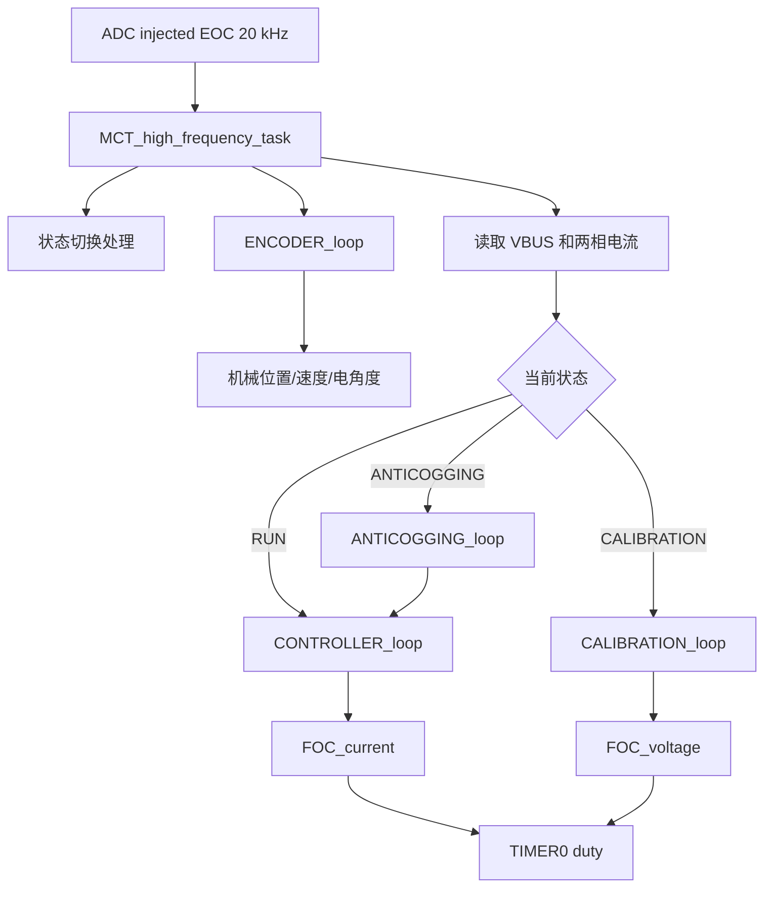

# CTM GD32H759 工程架构说明

本文档按当前工作区源码和 Keil 工程重新整理，描述 CTM 电机驱动器工程的目录结构、固件分层、实时任务、通信协议、Flash/DFU 边界和上位机配套关系。当前工程目标是 GD32H759 控制板上的三相永磁电机/BLDC/PMSM 驱动固件。

## 1. 工程组成

顶层目录以当前仓库实物为准：

```text
ctm/
├─ Firmware/
│  ├─ Firmware_app/          # 主应用固件：电机控制、CAN、校准、齿槽补偿、DFU 接收
│  └─ Firmware_boot/         # Bootloader：把备份应用区搬运到主应用区
├─ Hardware/                 # 原理图、3D STEP、GD32H759 数据手册和用户手册
├─ HostTool/                 # Python/Tkinter 上位机，使用 ZLG ControlCAN.dll
├─ doc/                      # 工程文档，本文件位于此处
├─ img/                      # README/手册使用的图片资源
├─ README.md                 # 原 CTM 项目介绍，部分旧描述需以当前源码为准
└─ ctm驱动器用户手册.pdf
```

当前 `doc` 目录下只有 `architecture.md` 一个 Markdown 文件。

## 2. 构建目标

| 固件 | Keil 工程 | Target | Device | IROM |
| --- | --- | --- | --- | --- |
| 主应用 | `Firmware/Firmware_app/MDK-ARM/ctm_app.uvprojx` | `ctm_app` | `GD32H759IM` | `0x08000000`, size `0x3C0000` |
| Bootloader | `Firmware/Firmware_boot/MDK-ARM/ctm_boot.uvprojx` | `ctm_boot` | `GD32H759IM` | `0x08080000`, size `0x10000` |

主应用 Keil 宏定义为：

```text
USE_STDPERIPH_DRIVER, GD32H7XX, GD32H7XXI, ARM_MATH_CM7
```

主应用包含业务源码、GD32H7xx 标准外设库、CMSIS、启动文件和 SEGGER RTT。Bootloader 只保留最小启动、Flash 擦写和搬运逻辑。

一致性注意：固件 DFU/Bootloader 逻辑仍把主应用运行区限制为 256 KB，见 `board_port.h` 的 `BOARD_FLASH_APP_MAX_SIZE = 0x40000`。当前 `ctm_app.uvprojx` 的 IROM 范围更大，发布给 DFU 的应用镜像必须保持在 256 KB 内，或同步调整 Flash map、Bootloader 和上位机限制。

## 3. 板级资源

板级资源由 `board_gd32h759.h` 描述，再由 `board_port.h` 映射成通用 `BOARD_*` 接口。GD32H759 使用 25 MHz HXTAL，`system_gd32h7xx.c` 配置 PLL0 到 600 MHz 系统时钟；PWM 相关计时按 300 MHz 定时器时钟计算。

主要资源如下：

| 资源 | 当前实现 |
| --- | --- |
| MCU | `GD32H759`, LQFP176, Cortex-M7 |
| PWM | `TIMER0`, 20 kHz, 中心对齐，三相互补输出 |
| 默认电机侧 | 左侧驱动；定义 `CTM_H759_USE_RIGHT_MOTOR` 可切换右侧 |
| 相电流采样 | 左侧：`ADC2` 的 `PC2_C/ADC2_IN0` 和 `PC3_C/ADC2_IN1`；右侧：`ADC0` 的 `PF11/PF12` |
| 母线电压 | `PF13/ADC1_IN2`, 分压系数 11 |
| 编码器默认接口 | PWM 绝对值编码器，左 `PB9/TIMER3_CH3/AF2`，右 `PB8/TIMER3_CH2/AF2`，2 MHz 捕获 tick, 32768 CPR |
| 兼容编码器接口 | SPI0 磁编码器读数路径仍保留，可通过 `CTM_H759_ENCODER_INTERFACE` 切换 |
| CAN | `CAN2`, `PD12/PD13`, classic CAN 标准帧，mailbox 0 接收、mailbox 1 发送 |
| 用户按键 | `KEY1/PA0`, `KEY2/PC0` |
| 状态 LED | 当前板图未提供 MCU 驱动 LED，`LED_ACT_*` 是空操作 |

左右驱动共用 `TIMER0`，右侧 HIN/LIN 与左侧在主/互补输出上的关系相反。代码通过编译期宏只选择一侧，不能同时启用左右两侧。

## 4. 新固件分层

本次工程改动把原先集中在 `main.c`、`encoder.c`、`can.c`、`dfu.c`、`usr_config.c` 中的硬件相关代码拆成较清晰的板级/硬件抽象层：

| 层级 | 文件 | 职责 |
| --- | --- | --- |
| 板级资源表 | `board_gd32h759.h` | GD32H759 引脚、外设、左右电机侧、编码器接口和 CAN 资源 |
| 板级适配口 | `board_port.h` | 把具体板卡资源映射为 `BOARD_*` 通用宏，集中定义 Flash map |
| 初始化 | `board_init.c/.h` | RCU、GPIO、SPI、ADC、PWM、系统定时器、NVIC、看门狗、MPU/Cache |
| 运行时 | `runtime.c/.h` | `SystickCount`、毫秒延时、看门狗喂狗、时间差计算 |
| 电机硬件门面 | `motor_hw.h` + `pwm_curr.c` | PWM 开关、三相 duty、相电流、母线电压、温度读取 |
| PWM/电流细节 | `pwm_curr.c/.h`, `pwm_curr_hw.h` | 20 kHz PWM、ADC 校准、ADC 标定和电流/电压换算 |
| 编码器硬件 | `encoder_hw.c/.h` | PWM 捕获编码器读数，兼容原 SPI 编码器读数 |
| CAN 硬件 | `can_hw.c/.h` | GD32 CAN2 初始化、收发、状态位、mailbox 复位 |
| Flash 硬件 | `flash_hw.c/.h` | 擦除、写 word、读后校验、DCache 失效、跳转 Bootloader |
| RTT 调试 | `rtt_scope.c/.h`, `rtt_mem.h` | RTT 日志和示波数据，XRAM3 非缓存窗口 |
| 状态 LED 兼容 | `status_led.h` | 为没有 LED 的板卡提供空操作 fallback |
| 公共类型 | `ctm_types.h` | `stdbool.h/stdint.h/stddef.h` 聚合 |

业务层仍由 `mc_task`、`controller`、`foc`、`encoder`、`calibration`、`anticogging`、`can`、`dfu`、`usr_config`、`trapTraj`、`util` 等模块组成。

## 5. 启动流程

主应用入口在 `Firmware/Firmware_app/Source/main.c`：

1. 关闭全局中断。
2. 配置 RTT 所在 XRAM3 的 MPU 属性，再初始化 RTT。
3. 打开 ICache/DCache。
4. `BOARD_init_peripherals()` 初始化 RCU、GPIO、SPI/编码器、相电流 ADC、母线 ADC、PWM、1 ms 系统定时器、引脚锁和 NVIC。
5. 初始化独立看门狗。
6. 读取用户配置，CRC 错误则加载默认值。
7. 读取齿槽补偿表，CRC 正确则置 `AnticoggingValid = true`，失败则建立全零表。
8. 按 `UsrConfig.node_id` 和 `UsrConfig.can_baudrate` 初始化 CAN。
9. 初始化状态机、FOC、PWMC、编码器和控制器。
10. 使能看门狗和全局中断。
11. 等待母线电压稳定，随后做 64 次相电流零点偏置标定。
12. 标定失败则置 `selftest` 错误，最后切到 `IDLE`。
13. 主循环持续执行 `MCT_low_priority_task()`。

严重异常统一进入 `Error_Handler()`，它会调用 `BOARD_emergency_shutdown()` 关闭 PWM 主输出并停在死循环。

## 6. 实时任务

固件是裸机结构，没有 RTOS。实时路径由中断优先级分层：

| 触发 | 频率 | 入口 | 职责 |
| --- | --- | --- | --- |
| 相电流 ADC 注入转换完成 | 20 kHz | `BOARD_PHASE_ADC_IRQHandler()` -> `MCT_high_frequency_task()` | 编码器采样、相电流/母线电压更新、状态机切换、控制器、FOC、过流检查、RTT scope |
| `TIMER1` 更新中断 | 1 kHz | `BOARD_SYSTEM_TIMER_IRQHandler()` -> `MCT_safety_task()` | 过压/欠压/温度检查、喂狗、`SystickCount++` |
| `CAN2` mailbox 0 中断 | 按帧触发 | `BOARD_CAN_IRQHandler()` -> `CAN_receive_callback()` | 读取 mailbox，解析协议命令 |
| `TIMER3_CH2/CH3` 捕获中断 | PWM 编码器边沿触发 | `TIMER3_IRQHandler()` -> `ENCODER_pwm_capture_callback()` | 左右 PWM 编码器高电平和周期捕获 |
| 主循环 | 尽快执行 | `MCT_low_priority_task()` | 状态字变化上报、LED 模式、CAN 心跳和 bus error 检查 |

高频任务的控制路径：



## 7. 状态机

状态定义在 `mc_task.h`：

```text
BOOT_UP -> IDLE -> RUN
              \-> CALIBRATION
              \-> ANTICOGGING
RUN/CALIBRATION/ANTICOGGING -> IDLE
```

状态含义：

| 状态 | 含义 |
| --- | --- |
| `BOOT_UP` | 启动阶段，只允许切到 `IDLE` |
| `IDLE` | 安全空闲态，FOC/PWM 关闭或只做低边预充 |
| `RUN` | 常规闭环运行，执行控制器和 FOC |
| `CALIBRATION` | 自动测量电机参数、编码器方向、极对数、offset 和 128 点 LUT |
| `ANTICOGGING` | 扫描一圈生成 5000 点齿槽补偿表 |

进入 `RUN` 和 `ANTICOGGING` 需要当前无错误且 `UsrConfig.calib_valid` 为真；进入 `CALIBRATION` 只要求当前无错误。由 `IDLE` 切入运行类状态时，代码先 `FOC_arm()`，再等待 `CHARGE_BOOT_CAP_MS = 10 ms` 对应的 PWM tick，用于驱动自举电容预充。

低优先级任务检测到错误字变化时会关闭 FOC 并切回 `IDLE`。`selftest` 是 fatal 位，`MCT_reset_error()` 只清除非 fatal 错误。

## 8. 控制链路

### 8.1 编码器

当前默认编码器接口是 PWM 绝对值输入：

- `ENCODER_CPR = 32768`。
- 捕获输入为左 `PB9/TIMER3_CH3`、右 `PB8/TIMER3_CH2`。
- `encoder_hw.c` 交替捕获上升/下降沿，得到高电平 tick 和周期 tick。
- 只有周期落在 `1000..40000` tick 且高电平合理时才更新 raw 计数。
- 周期锁定需要连续 3 个样本，周期容差为 25%。
- 单步 raw 跳变超过 `CPR/16` 时丢弃，沿用上一次读数。

`encoder.c` 对 raw 计数做方向处理、128 点 offset LUT 线性化、PLL 位置/速度估计，输出：

- `Encoder.pos`：多圈机械位置，单位转。
- `Encoder.vel`：机械速度，单位转/秒。
- `Encoder.phase`：电角度。
- `Encoder.phase_vel`：电角速度。

### 8.2 控制模式

控制模式定义在 `controller.h`：

| 模式 | 编号 | 行为 |
| --- | --- | --- |
| `CONTROL_MODE_CURRENT_RAMP` | 0 | 电流目标按 `current_ramp_rate` 斜坡变化 |
| `CONTROL_MODE_VELOCITY_RAMP` | 1 | 速度目标按 `velocity_ramp_rate` 斜坡变化，再经速度环输出电流 |
| `CONTROL_MODE_POSITION_FILTER` | 2 | 二阶位置滤波生成位置/速度/加速度目标 |
| `CONTROL_MODE_POSITION_PROFILE` | 3 | 梯形位置轨迹规划，使用 `trapTraj` |

CAN 下发的目标先写入 `Controller.input_*_buffer`。当 `sync_target_enable = 0` 时命令立即同步；启用同步模式后必须收到 `SYNC` 才把 buffer 应用到控制器输入。

### 8.3 FOC

FOC 模块执行 Clarke/Park、D/Q 电流 PI、反 Park、SVM 和三相 duty 输出。常规闭环入口为：

```c
FOC_current(0, iq_set, Encoder.phase, Encoder.phase_vel);
```

当前 `Id` 固定为 0，`Iq` 来自控制器速度/位置/电流链路，并可叠加齿槽补偿。FOC 输出通过 `MOTOR_HW_set_phase_duty()` 写到 `TIMER0` 三相比较寄存器。

## 9. 校准与齿槽补偿

自动校准由 `CALIBRATION_loop()` 分步执行：

1. 注入 A 相电流，估算相电阻。
2. 正负电压切换，按电流变化率估算相电感。
3. 转动电角度，估算编码器方向和电机极对数。
4. 顺/逆方向采样编码器误差。
5. 计算平均 `encoder_offset` 和 128 点 `offset_lut`。
6. 通过 CAN 分包上报 LUT，置 `calib_valid = true`，返回 `IDLE`。

校准临时数组大小按 30 极对数、每极对 128 点分配。开始校准时会释放齿槽补偿表内存，结束后再从 Flash 重新加载或建立默认表。

齿槽补偿由 `ANTICOGGING_loop()` 生成：

- 表长度 `COGGING_MAP_NUM = 5000`。
- 先顺时针移动并记录 `Foc.i_q_filt * 5000`。
- 再逆时针移动并与原表取平均。
- 完成后发送 step 5000 的报告，置 `AnticoggingValid = true` 并回到 `IDLE`。
- 保存到 Flash 时由 `USR_CONFIG_save_cogging_map()` 写入 `COGGING_MAP` 区。

## 10. 用户配置

固件版本定义在 `usr_config.h`：

```text
FW_VERSION_MAJOR = 3
FW_VERSION_MINOR = 5
```

`tUsrConfig` 中通过 CAN 开放的用户参数为前 33 个 32-bit 字段：

| 类别 | 参数 |
| --- | --- |
| Motor | 方向、电机极对数、相电阻、相电感、电流限制、速度限制 |
| Calibration | 校准电流、校准电压 |
| Controller | 位置环、速度环、电流环带宽、默认控制模式、齿槽补偿开关、同步模式、到位窗口、斜坡和 profile 参数 |
| Protect | 欠压、过压、过流、驱动过温、NTC 过温 |
| CAN | 节点 ID、波特率、心跳消费超时、心跳生产周期 |

编码器校准结果、128 点 LUT 和 CRC 是自动字段，不在普通 `GET_CONFIG/SET_CONFIG` 的 33 个用户参数范围内。默认参数由 `USR_CONFIG_set_default_config()` 建立，保存时计算 CRC32，读取时 CRC 不匹配则回退默认值。

## 11. Flash 与 DFU

Flash map 由 `board_port.h` 定义：

| 区域 | 地址 | 大小 | 用途 |
| --- | --- | --- | --- |
| `APP_MAIN` | `0x08000000` | `0x40000` / 256 KB | 主应用运行区 |
| `APP_BACK` | `0x08040000` | `0x40000` / 256 KB | DFU 下载备份区 |
| `BOOTLOADER` | `0x08080000` | `0x10000` / 64 KB | 搬运 Bootloader |
| `USR_CONFIG` | `0x08090000` | `0x1000` / 4 KB | 用户参数，带 CRC |
| `COGGING_MAP` | `0x08091000` | `0x4000` / 16 KB | 齿槽补偿表，带 CRC |

主应用侧 DFU 流程：

1. `DFU_START`：擦除 `APP_BACK`。
2. `DFU_DATA`：按 CAN payload 写入备份区。
3. `DFU_END`：校验接收字节数和 CRC32。
4. 校验成功后回复 ACK，延时并跳转 `BOOTLOADER`。

Bootloader 位于 `Firmware/Firmware_boot/Source/main.c`。它不解析 CAN，也不下载固件，只负责最多重试 5 次：擦除 `APP_MAIN`、把整个 `APP_BACK` 256 KB 复制到 `APP_MAIN`、逐字校验，成功后系统复位。

`flash_hw.c` 在主应用侧统一处理 GD32H7 Flash 擦写、写后校验和 DCache 失效，避免读取刚写入 Flash 时被缓存影响。

## 12. CAN 协议

固件使用 classic CAN，标准 11 bit ID：

```text
bit10   echo 标志
bit9..5 节点 ID，1..31；节点 0 为广播接收
bit4..0 命令 ID
```

payload 固定按小端格式复制 C 侧 `int32_t`、`uint32_t` 和 `float`，单帧最大 8 字节。当前固件没有使用 CAN-FD 长 payload。

| 命令 | ID | 说明 |
| --- | --- | --- |
| `SET_OP_MODE` | 0 | 设置控制模式 |
| `MOTOR_ENABLE` / `MOTOR_DISABLE` | 1 / 2 | 进入 `RUN` 或回到 `IDLE` |
| `SET_TORQUE` | 3 | 设置电流目标 |
| `SET_VELOCITY` | 4 | 设置速度目标 |
| `SET_POSITION` | 5 | 设置位置目标 |
| `SYNC` | 6 | 同步应用目标 buffer |
| `CALIB_START` / `CALIB_REPORT` / `CALIB_ABORT` | 7 / 8 / 9 | 自动校准控制和上报 |
| `ANTICOGGING_START` / `ANTICOGGING_REPORT` / `ANTICOGGING_ABORT` | 10 / 11 / 12 | 齿槽补偿扫描控制和上报 |
| `SET_HOME` | 13 | 当前位置置零 |
| `ERROR_RESET` | 14 | 清除非 fatal 错误 |
| `GET_STATUSWORD` / `STATUSWORD_REPORT` | 15 / 16 | 查询或上报状态字 |
| `GET_VALUE_1` / `GET_VALUE_2` | 17 / 18 | 读取实时量 |
| `HEARTBEAT` | 23 | 心跳 |
| `SET_CONFIG` / `GET_CONFIG` | 24 / 25 | 写/读 33 个用户参数 |
| `SAVE_ALL_CONFIG` / `RESET_ALL_CONFIG` | 26 / 27 | 保存全部参数/恢复默认 |
| `GET_FW_VERSION` | 28 | 读取固件版本 |
| `DFU_START` / `DFU_DATA` / `DFU_END` | 29 / 30 / 31 | 固件升级 |

`GET_VALUE_*` 当前索引含义：

| 索引 | 返回值 |
| --- | --- |
| 0 | `Foc.i_q_filt`，受 `invert_motor_dir` 影响 |
| 1 | `Encoder.vel`，受 `invert_motor_dir` 影响 |
| 2 | `Encoder.pos`，受 `invert_motor_dir` 影响 |
| 3 | `Foc.v_bus_filt` |
| 4 | `Foc.i_bus_filt` |
| 5 | `Foc.power_filt` |
| 6 | 驱动温度 |
| 7 | NTC 温度 |

关键命令会通过 RTT 打印收发日志；CAN bus 进入 passive 或 bus-off 时，低优先级任务会中止当前发送 mailbox 并重置接收 mailbox。

## 13. 上位机

当前上位机位于 `HostTool/`，不是旧 README 中的 `ctm_tool/`。它使用 Python 标准库 Tkinter 和 ZLG `ControlCAN.dll`，源码入口为：

```powershell
cd D:\Learing_Materials\ctm\HostTool
python run_ctm_host.py
```

默认连接参数与固件默认配置一致：

| 参数 | 默认值 |
| --- | --- |
| 设备类型 | `USBCAN-I` / `3` |
| 设备号 | `0` |
| 通道 | `0` |
| CAN 波特率 | `500K` |
| 节点 ID | `1` |

已实现能力包括连接/断开 ZLG USB CAN、读取版本和状态、实时数据读取、控制模式切换、电机使能/失能、目标下发、同步目标、回零、清错、33 个用户参数读写、保存到 Flash、恢复默认、自动校准、齿槽补偿和 `.bin`/Intel HEX `.hex` DFU。

## 14. 保护与错误

状态字定义在 `mc_task.h`：

| 错误位 | 来源 |
| --- | --- |
| `over_voltage` | 1 ms 安全任务比较 `Foc.v_bus` 与 `protect_over_voltage` |
| `under_voltage` | 1 ms 安全任务比较 `Foc.v_bus` 与 `protect_under_voltage` |
| `over_current` | 20 kHz 高频任务比较三相电流绝对值与 `protect_over_current` |
| `drv_over_tmp` | 1 ms 安全任务读取驱动温度 |
| `ntc_over_tmp` | 1 ms 安全任务读取 NTC 温度 |
| `selftest` | 启动相电流偏置异常、校准失败等 fatal 自检错误 |

当前 GD32H759 板级宏关闭温度 ADC，驱动温度和 NTC 温度默认返回 25 摄氏度。若后续接入温度采样，需要补齐 `BOARD_HAS_TEMP_ADC` 相关采样和 `adc_buff[1..2]` 更新路径。

## 15. 调试与内存

- RTT 默认开启：`CTM_ENABLE_RTT_SCOPE = 1`。
- RTT 使用 XRAM3 `0x30004000..0x30007FFF`，`board_init.c` 先配置 MPU 非缓存，再开启 DCache。
- RTT scope channel 1 每 20 个高频周期输出一次 6 个 float：`i_a/i_b/i_c/v_bus_filt/pos/vel`。
- 动态堆大小为 16 KB，用于校准误差数组和齿槽补偿表。校准开始会释放齿槽表，避免与校准数组同时占用堆空间。

## 16. 维护注意事项

- 新增硬件相关代码优先放在 `board_*`、`*_hw.*` 或 `motor_hw` 门面下，业务层不要直接散落 GD32 寄存器细节。
- 修改 Flash 布局时必须同步 `board_port.h`、Bootloader、DFU 上位机限制和 Keil IROM 范围。
- 修改编码器类型时同步 `CTM_H759_ENCODER_INTERFACE`、GPIO/NVIC 初始化和 `ENCODER_CPR`。
- 当前状态 LED 是空操作，不应把 LED 闪烁作为 GD32H759 板的唯一调试依据。
- CAN payload 仍按 classic CAN 8 字节处理，上位机和固件都不要假设 CAN-FD 长帧可用。
