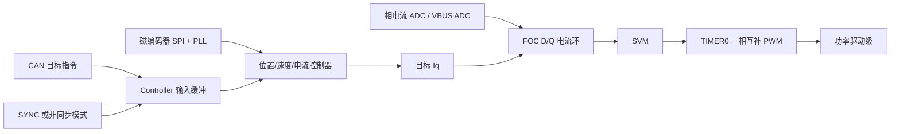

# CTM 驱动器工程架构说明

本文档基于当前工作区源码、Keil 工程配置、README、硬件资料目录和发布产物整理，用于快速理解整个 CTM 三相永磁电机/BLDC/PMSM 驱动器工程的组成、运行路径和模块边界。

## 1. 工程定位

CTM 是一个开源电机驱动器工程，包含：

- 三相永磁电机/BLDC/PMSM 驱动固件
- GD32H759 控制板硬件资料
- Windows 上位机调试工具
- 用户手册、原理图、3D 结构文件和调试截图

固件核心能力包括 FOC 矢量控制、CAN 通信、位置/速度/电流控制、自动电机参数和编码器校准、齿槽转矩补偿、Flash 参数保存和 CAN DFU 固件升级。

## 2. 顶层目录结构

```text
dgm/
├─ Firmware/
│  ├─ Firmware_app/          # 主应用固件：电机控制、通信、校准、DFU 接收
│  ├─ Firmware_boot/         # 升级搬运 bootloader：备份区复制到主应用区
│  └─ Release/               # 已构建的 bin/hex 发布产物
├─ Hardware/                 # 原理图、3D STEP、GD32H759 数据手册/用户手册等
├─ ctm_tool/                 # Windows 上位机调试程序
├─ img/                      # README 和文档引用的产品/调试界面/控制框图图片
├─ doc/                      # 项目文档目录，本文件位于此处
├─ README.md                 # 项目介绍、参数、图片和使用说明
└─ ctm驱动器用户手册.pdf       # 用户使用手册
```

## 3. 硬件与构建目标

### 3.1 MCU 与板级资源

当前工程目标从旧的 GD32C10x 迁移到 GD32H759，Keil 目标器件为 `GD32H759IM`，核心为 Cortex-M7，启用双精度 FPU，CMSIS/SPL 宏为：

```text
USE_STDPERIPH_DRIVER, GD32H7XX, GD32H7XXI, ARM_MATH_CM7
```

板级资源集中在 `Firmware/Firmware_app/Source/board_gd32h759.h`：

- PWM：`TIMER0`，20 kHz，中点对齐，三相互补输出
- 相电流 ADC：左电机默认使用 `ADC2` 的两个注入通道
- 母线电压 ADC：`ADC1` 常规通道，带分压系数
- 编码器 SPI：`SPI0`，16 位传输，默认选择左侧编码器 CS
- CAN：`CAN2`，标准 11 bit ID，使用 mailbox 0 接收、mailbox 1 发送
- 用户按键：`KEY1/PA0`、`KEY2/PC0`
- 状态 LED：当前 GD32H759 控制板未暴露 MCU 驱动状态 LED，LED API 保留为空操作

默认选择左侧电机驱动通道：

```c
#if !defined(CTM_H759_USE_RIGHT_MOTOR)
#define CTM_H759_USE_LEFT_MOTOR 1
#endif
```

如需切换右侧驱动，需要在编译宏中定义 `CTM_H759_USE_RIGHT_MOTOR`，且不能同时定义左右两侧。

### 3.2 Keil 工程

| 工程 | 路径 | 目标 | IROM |
| --- | --- | --- | --- |
| 主应用 | `Firmware/Firmware_app/MDK-ARM/ctm_app.uvprojx` | `ctm_app` | `0x08000000`, size `0x40000` |
| Bootloader | `Firmware/Firmware_boot/MDK-ARM/ctm_boot.uvprojx` | `ctm_boot` | `0x08080000`, size `0x10000` |

主应用包含业务源码、GD32H7xx 标准外设库、CMSIS 启动文件和 SEGGER RTT；bootloader 只包含最小启动文件、Flash/FWDGT/PMU 等外设库和升级搬运逻辑。

### 3.3 时钟

`system_gd32h7xx.c` 选择 25 MHz HXTAL，经 PLL0 配置为 600 MHz 系统时钟。`main.c` 中将 TIMER 时钟预分频配置为 `RCU_TIMER_PSC_MUL2`，PWM 相关宏按 `TIMER0_CLK_MHz = 300` 计算。

## 4. Flash 内存布局

Flash 基址来自 GD32H7xx 头文件：`FLASH_BASE = 0x08000000`。

| 区域 | 地址 | 大小 | 用途 |
| --- | --- | --- | --- |
| `APP_MAIN` | `0x08000000` | `0x40000` / 256 KB | 主应用运行区 |
| `APP_BACK` | `0x08040000` | `0x40000` / 256 KB | DFU 下载备份区 |
| `BOOTLOADER` | `0x08080000` | `0x10000` / 64 KB | 升级搬运程序 |
| `USR_CONFIG` | `0x08090000` | `0x1000` / 4 KB | 用户参数，带 CRC |
| `COGGING_MAP` | `0x08091000` | `0x4000` / 16 KB | 齿槽补偿表，带 CRC |

升级链路为：

1. 上位机通过 CAN 下发 `DFU_START`，主应用擦除 `APP_BACK`。
2. 上位机通过 `DFU_DATA` 分包写入备份区。
3. `DFU_END` 携带大小和 CRC，主应用校验 `APP_BACK`。
4. 校验通过后主应用跳转到 `BOOTLOADER`。
5. Bootloader 将 `APP_BACK` 整区复制到 `APP_MAIN`，成功后复位。

## 5. 固件总体架构

主应用是裸机实时控制架构，没有 RTOS。任务按中断优先级和执行频率分层：

```mermaid
flowchart TD
    Boot[Reset / main] --> Init[外设初始化<br/>RCU GPIO SPI ADC TIMER CAN NVIC WDG]
    Init --> Config[读取用户参数和齿槽补偿表<br/>CRC 失败则加载默认值]
    Config --> Modules[初始化 MCT FOC PWMC ENCODER CONTROLLER]
    Modules --> Idle[进入 IDLE]

    ADCIRQ[ADC 注入转换完成中断<br/>20 kHz] --> HF[MCT_high_frequency_task]
    HF --> Encoder[ENCODER_loop]
    HF --> Sample[采样 VBUS 和相电流]
    HF --> StateRun{状态}
    StateRun -->|RUN| Controller[CONTROLLER_loop]
    StateRun -->|CALIBRATION| Calibration[CALIBRATION_loop]
    StateRun -->|ANTICOGGING| Anticogging[ANTICOGGING_loop + CONTROLLER_loop]
    Controller --> FOC[FOC_current]
    FOC --> PWM[SVM 占空比写入 TIMER0]

    T1IRQ[TIMER1 中断<br/>1 ms] --> Safety[MCT_safety_task]
    Safety --> Watchdog[喂独立看门狗]

    MainLoop[while(1)] --> LP[MCT_low_priority_task]
    LP --> CanLoop[CAN_comm_loop]
    LP --> Status[状态/错误上报]
```

### 5.1 实时层级

| 层级 | 触发源 | 频率 | 主要职责 |
| --- | --- | --- | --- |
| 高频控制层 | 相电流 ADC 注入转换完成中断 | 20 kHz | 编码器采样、相电流/母线电压采样、状态机切换、控制器、FOC、电流保护 |
| 安全与节拍层 | `TIMER1_IRQHandler` | 1 kHz | 母线电压/温度保护、系统毫秒计数、喂狗 |
| 低优先级层 | `main` 主循环 | 尽可能快 | CAN 心跳、CAN 错误处理、状态上报、低频 LED 状态 |

## 6. 主应用启动流程

`Firmware/Firmware_app/Source/main.c` 的启动顺序：

1. 关闭中断，打开 ICache/DCache。
2. 初始化时钟、GPIO、SPI0、相电流 ADC、VBUS ADC、TIMER0 PWM、TIMER1、引脚锁定、NVIC、独立看门狗。
3. 从 Flash 读取 `UsrConfig`，CRC 失败时加载默认参数。
4. 读取齿槽补偿表，CRC 成功则 `AnticoggingValid = true`，失败则创建默认零表。
5. 按配置设置 CAN 节点 ID 和波特率。
6. 初始化状态机、FOC、PWM/ADC、电角度编码器、控制器。
7. 启用看门狗和中断。
8. 等待母线电压稳定。
9. 进行相电流零点偏置校准，失败则置 `selftest` 错误。
10. 状态机切到 `IDLE`。
11. 进入 `while(1)`，循环执行 `MCT_low_priority_task()`。

## 7. 模块职责

| 模块 | 文件 | 职责 |
| --- | --- | --- |
| 板级映射 | `board_gd32h759.h` | 引脚、外设、ADC/PWM/CAN/SPI 资源映射，左右电机通道选择 |
| 主入口 | `main.c/.h` | 外设初始化、Flash 地址定义、看门狗、启动流程 |
| 中断 | `gd32h7xx_it.c/.h` | Fault 处理、ADC 高频控制入口、1 ms 安全任务、CAN 接收入口 |
| 状态机 | `mc_task.c/.h` | BOOT/IDLE/RUN/CALIBRATION/ANTICOGGING 状态管理、安全保护、任务调度 |
| PWM/电流采样 | `pwm_curr.c/.h` | 20 kHz PWM、ADC 标定、相电流和母线电压换算、低侧导通/开关 PWM |
| FOC | `foc.c/.h` | Clarke/Park、D/Q 电流 PI、逆 Park、SVM、占空比输出 |
| 编码器 | `encoder.c/.h` | SPI 读取 14 bit 磁编码器、线性化、PLL 估算位置/速度/电角度 |
| 控制器 | `controller.c/.h` | 电流爬升、速度爬升、位置滤波、梯形位置规划、速度环/位置环/限幅 |
| 梯形轨迹 | `trapTraj.c/.h` | 位置 profile 的加速、匀速、减速轨迹规划和采样 |
| CAN | `can.c/.h` | 11 bit ID 协议、命令解析、状态/参数/DFU/校准接口、心跳和错误处理 |
| 参数配置 | `usr_config.c/.h` | 默认参数、Flash 读写、CRC 校验、齿槽补偿表保存 |
| 校准 | `calibration.c/.h` | 电阻、电感、方向/极对数、编码器 offset/LUT 自动测量 |
| 齿槽补偿 | `anticogging.c/.h` | 按位置扫描并生成 5000 点电流补偿表 |
| DFU | `dfu.c/.h` | 主应用侧擦写备份区、CRC 校验、跳转 bootloader |
| 堆管理 | `heap.c/.h` | 16 KB 静态堆，供校准数组和齿槽表动态分配 |
| 工具函数 | `util.c/.h` | 快速 sin/cos、CRC32、坐标变换、SVM、字节序转换 |

## 8. 状态机

状态定义在 `mc_task.h`：

```text
BOOT_UP -> IDLE -> RUN
              \-> CALIBRATION
              \-> ANTICOGGING
RUN/CALIBRATION/ANTICOGGING -> IDLE
```

状态含义：

- `BOOT_UP`：启动初期，等待系统完成初始化。
- `IDLE`：空闲安全态，PWM 关闭或低侧预充，允许进入运行、校准和齿槽补偿。
- `RUN`：常规闭环运行，执行控制器和 FOC。
- `CALIBRATION`：执行电机和编码器自动校准。
- `ANTICOGGING`：按一圈位置扫描齿槽转矩补偿表。

状态进入 `RUN` 或 `ANTICOGGING` 需要：

- 当前无错误位。
- `UsrConfig.calib_valid` 为真。

状态进入 `CALIBRATION` 需要：

- 当前无错误位。

任意运行状态出现过流、过压、欠压、过温或低优先级检测到错误变化时，会关闭 FOC/PWM 并回到 `IDLE`。

## 9. 控制链路

### 9.1 数据路径



### 9.2 控制模式

控制模式定义在 `controller.h`：

| 模式 | 编号 | 行为 |
| --- | --- | --- |
| `CONTROL_MODE_CURRENT_RAMP` | 0 | 输入电流按 `current_ramp_rate` 斜坡变化，直接给出 `Iq` 目标 |
| `CONTROL_MODE_VELOCITY_RAMP` | 1 | 输入速度按 `velocity_ramp_rate` 斜坡变化，速度环输出 `Iq` |
| `CONTROL_MODE_POSITION_FILTER` | 2 | 二阶位置滤波生成位置/速度/加速度目标 |
| `CONTROL_MODE_POSITION_PROFILE` | 3 | 梯形轨迹规划生成位置/速度/加速度目标 |

控制器最终都会调用：

```c
FOC_current(0, iq_set, phase_meas, phase_vel_meas);
```

其中 `Id` 固定为 0，`Iq` 经过速度环、齿槽补偿和电流限幅后进入 FOC。

### 9.3 FOC 电流环

FOC 主要步骤：

1. 相电流 `i_a/i_b/i_c` 经过 Clarke 变换得到 `alpha/beta`。
2. 使用编码器电角度做 Park 变换得到 `i_d/i_q`。
3. D/Q 电流 PI 产生 `v_d/v_q`。
4. 按母线电压归一化并进行电压矢量限幅。
5. 用 `phase + phase_vel * CURRENT_MEASURE_PERIOD` 做相位前馈。
6. 逆 Park 得到 `alpha/beta` 调制量。
7. SVM 计算三相 duty，写入 TIMER0 比较寄存器。

当前 PWM/电流环频率为 20 kHz，电流控制带宽默认 1000 Hz。

## 10. 编码器与校准

### 10.1 编码器

编码器参数：

- 分辨率：`ENCODER_CPR = 16384`，14 bit
- 通信：SPI0，命令读两个 8 bit 数据片段，组合后右移 2 位
- 线性化：使用 `UsrConfig.offset_lut[128]` 做插值补偿
- 速度估计：PLL，默认带宽约 100 Hz

输出量：

- `Encoder.pos`：多圈机械位置，单位为转
- `Encoder.vel`：机械速度，单位为转/秒
- `Encoder.phase`：电角度
- `Encoder.phase_vel`：电角速度

### 10.2 自动校准

校准流程由 `CALIBRATION_loop()` 分步执行：

1. `MOTOR_R`：沿 A 相注入电流，估计相电阻。
2. `MOTOR_L`：正负电压切换，按电流变化率估计相电感。
3. `DIR_PP`：旋转电角度，判断编码器方向并估计电机极对数。
4. `ENCODER_CW/CCW`：顺/逆两个方向采样编码器误差。
5. `ENCODER_END`：计算平均 offset 和 128 点 offset LUT。
6. `REPORT_OFFSET_LUT`：通过 CAN 回报 LUT，设置 `calib_valid = true`，回到 `IDLE`。

校准中会动态申请误差数组，最大按 30 极对数、每极对 128 点采样。

### 10.3 齿槽补偿

齿槽补偿由 `ANTICOGGING_loop()` 生成 `COGGING_MAP_NUM = 5000` 点表：

- 先按顺时针方向移动并记录 `Foc.i_q_filt`。
- 再按逆时针方向移动并与已有表取平均。
- 每个位置点以 `int16_t` 保存，控制时按 `map[index] / 5000.0f` 叠加到 `Iq`。
- 生成结束后 `AnticoggingValid = true` 并回到 `IDLE`。

## 11. CAN 通信协议

CAN 使用 11 bit 标准 ID：

```text
bit10      : echo 标记
bit9..5    : node id，5 bit，1~31，0 表示广播
bit4..0    : cmd id，5 bit
```

常用命令：

| 命令 | ID | 说明 |
| --- | --- | --- |
| `SET_OP_MODE` | 0 | 设置控制模式 |
| `MOTOR_ENABLE` / `MOTOR_DISABLE` | 1 / 2 | 进入 RUN 或 IDLE |
| `SET_TORQUE` | 3 | 设置目标电流 |
| `SET_VELOCITY` | 4 | 设置目标速度 |
| `SET_POSITION` | 5 | 设置目标位置 |
| `SYNC` | 6 | 同步应用输入缓冲 |
| `CALIB_START` / `CALIB_ABORT` | 7 / 9 | 启动/中止自动校准 |
| `ANTICOGGING_START` / `ANTICOGGING_ABORT` | 10 / 12 | 启动/中止齿槽补偿扫描 |
| `SET_HOME` | 13 | 设置当前位置为零点 |
| `ERROR_RESET` | 14 | 清除非致命错误 |
| `GET_STATUSWORD` | 15 | 查询状态字 |
| `GET_VALUE_1/2` | 17 / 18 | 读取电流、速度、位置、电压、功率、温度等运行量 |
| `HEARTBEAT` | 23 | 心跳 |
| `SET_CONFIG` / `GET_CONFIG` | 24 / 25 | 参数读写 |
| `SAVE_ALL_CONFIG` / `RESET_ALL_CONFIG` | 26 / 27 | 参数保存/恢复默认 |
| `GET_FW_VERSION` | 28 | 固件版本 |
| `DFU_START` / `DFU_DATA` / `DFU_END` | 29 / 30 / 31 | 固件升级 |

接收在 CAN 中断中完成，命令解析在 `CAN_receive_callback()` 的上下文中执行；心跳、发送超时和 CAN bus 错误检查在主循环低优先级任务中执行。

## 12. 用户配置模型

`UsrConfig` 包含以下配置域：

- Motor：方向、极对数、相电阻/电感、电流/速度限制
- Calibration：校准电流、电压
- Controller：位置环、速度环、电流环带宽、默认模式、斜坡、profile 参数
- Protect：欠压、过压、过流、驱动温度、NTC 温度阈值
- CAN：节点 ID、波特率、心跳生产/消费时间
- Encoder：校准有效标志、方向、offset、128 点 LUT
- CRC：结构体尾部 CRC32

默认参数在 `USR_CONFIG_set_default_config()` 中定义。配置写入 Flash 前计算 CRC，读取时 CRC 不匹配则认为配置无效并回退默认值。

当前固件版本定义为：

```text
FW_VERSION_MAJOR = 3
FW_VERSION_MINOR = 5
```

## 13. Bootloader 架构

Bootloader 位于 `Firmware/Firmware_boot/Source/main.c`，功能非常聚焦：

1. 设置 `SCB->VTOR = BOOTLOADER_ADDR`。
2. 最多重试 5 次：
   - 擦除 `APP_MAIN`
   - 将 `APP_BACK` 以 32 bit word 写入 `APP_MAIN`
   - 写后逐字校验
   - 成功后 `NVIC_SystemReset()`
3. 如果持续失败，则停留在死循环并喂狗。

Bootloader 不解析通信协议，也不下载固件；它只负责把主应用已校验过的备份固件搬运到运行区。

## 14. 保护与错误处理

错误位定义在 `tMCStatusword`：

- `over_voltage`
- `under_voltage`
- `over_current`
- `drv_over_tmp`
- `ntc_over_tmp`
- `selftest`

保护来源：

- 过流：高频任务中比较三相电流绝对值和 `protect_over_current`。
- 过压/欠压：1 ms 安全任务中比较 `Foc.v_bus` 和阈值。
- 温度：1 ms 安全任务中读取驱动温度/NTC 温度。当前 GD32H759 板级宏关闭温度 ADC，默认温度为 25 ℃。
- 自检：启动后相电流 ADC 偏置不在阈值内时置位。

严重 fault handler 会调用 `Error_Handler()`，关闭 TIMER0 主 PWM 输出并停机。

## 15. 发布与外部资料

`Firmware/Release` 中包含：

- `ctm_app_fw.bin`
- `ctm_app_fw.hex`
- `ctm_boot.bin`
- `ctm_boot.hex`

`Hardware` 中包含：

- `ctm_rev3_0_schematic.pdf`
- `ctm_rev3_0_3D.step`
- `GD32H759xx Datasheet_Rev2.1.pdf`
- `GD32H73x_75x_用户手册 _Rev1.8.pdf`
- `GD32电控.pdf`

`ctm_tool` 中包含 Windows 64 位上位机 `ctm_tool_x64-1.7.exe`，README 展示了调试、校准、配置和 DFU 界面。

## 16. 关键架构注意点

- 当前工程是裸机实时控制，所有控制闭环都在 ADC 中断里完成，新增逻辑应避免阻塞高频中断。
- 主应用和 bootloader 的 Flash 地址相互依赖，修改 Keil IROM 或 Flash map 时必须同步更新 `main.h`、`Firmware_boot/Source/main.c` 和升级工具侧约定。
- `COGGING_MAP` 使用动态堆分配，堆总大小只有 16 KB；新增动态内存使用要关注 `tCoggingMap` 和校准数组的峰值占用。
- CAN payload 固定按 8 字节 classic CAN 处理，当前 `CAN-FD` 仅在 README 中说明为可扩展方向，固件实现没有使用 CAN-FD 大 payload。
- `board_gd32h759.h` 同时描述左右两套电机驱动资源，但默认只选择左侧；硬件通道切换是编译期选择。
- GD32H759 当前状态 LED API 是 no-op，依赖 LED 状态提示的调试方式在此板上不可用。
